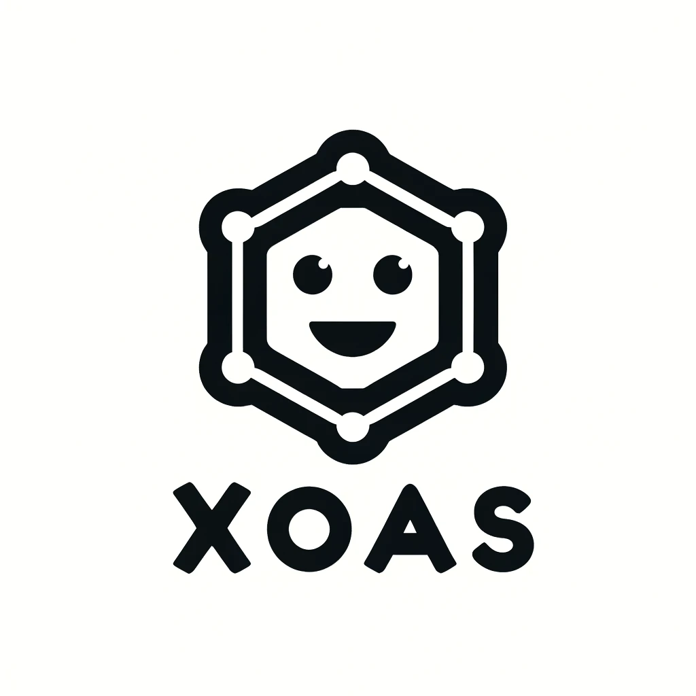

# XOAS: Your Personal Buddy 😊



XOAS is a locally hosted chatbot designed to process domain-specific queries from PDF files and deliver precise, conversational responses. Built with privacy and efficiency in mind, it operates entirely on local infrastructure, ensuring robust data security and seamless operation.

---

## 🚀 Features

- **PDF Embedding:** Converts PDF files into vector embeddings using Hugging Face’s BGE model.
- **Q&A Retrieval:** Utilizes Qdrant for efficient retrieval of domain-specific data.
- **Chatbot Responses:** Generates concise and professional replies using LLaMA 3.2.
- **Interactive Interface:** Powered by Streamlit for a user-friendly experience.
- **Localized Infrastructure:** Operates without reliance on external APIs, ensuring data privacy.

---

## 🔧 Technology Stack

| Technology               | Logo |
| ------------------------ | ---- |
| **Vector Database**      |  |
| **Embedding Model**      |  |
| **Language Model**       |  |
| **Frontend**             |  |
| **Programming Language** |  |
| **Containerization**     |  |

### Combined Technology Stack


---

## 🎥 Demo

Watch a live demo of XOAS in action:

[](https://www.loom.com/share/5969e8c373e94f51985bfa4829f89186)

---

## 🌐 Application Workflow

1. **PDF Embedding:**

   - Extracts and splits text from PDFs into manageable chunks.
   - Converts text into vector embeddings using Hugging Face BGE.
   - Stores embeddings in Qdrant with metadata for retrieval.

2. **Chatbot Interaction:**

   - Routes domain-specific queries to Qdrant for embedding-based retrieval.
   - Handles general queries with LLaMA for conversational responses.

3. **User-Friendly Interface:**

   - Upload PDFs and interact seamlessly via a Streamlit-based interface.

---

## 💡 Advantages

1. **Localized Infrastructure:** Operates without reliance on external APIs, reducing costs and enhancing privacy.
2. **Data Security:** Ensures sensitive data remains within the local network.
3. **Efficiency:** Avoids redundant embedding creation with JSON-based tracking and ensures concise responses with optimized LLaMA settings.
4. **Scalability:** Modular design supports future feature integration and model upgrades.

---

## 🛠️ Prerequisites

Ensure the following are installed on your system:

- Python 3.10.9 or later
- Docker
- Ollama
- IDE (e.g., VS Code)

---

## 🔧 Setup Instructions

### 1. Install Ollama and Download LLaMA Model:

```bash
# Install Ollama from https://ollama.com/
ollama pull llama 3.2:3b
ollama run llama 3.2:3b
```

### 2. Set Up Qdrant with Docker:

```bash
docker pull qdrant/qdrant
docker run -p 6333:6333 -v .:/qdrant/storage qdrant/qdrant
```

### 3. Install Python Dependencies:

```bash
python -m venv env
source env/bin/activate  # For Windows: env\Scripts\activate
pip install -r requirements.txt
```

### 4. Run the Application:

```bash
streamlit run app.py
```

---

## 🔎 Challenges Faced

- **Hardware Limitations:** The system runs locally with 12GB of RAM and 256GB SSD storage without GPU support.
- **Latent Response Times:** Resource constraints result in slightly longer response times.

---

## 🔒 License

This project is licensed under the [MIT License](LICENSE).

---

Feel free to fork, clone, and contribute to XOAS! Your feedback and enhancements are always welcome. 🌟

